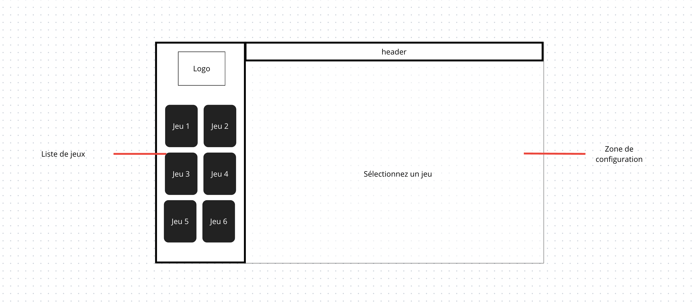
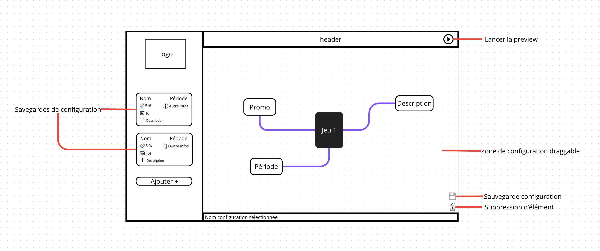
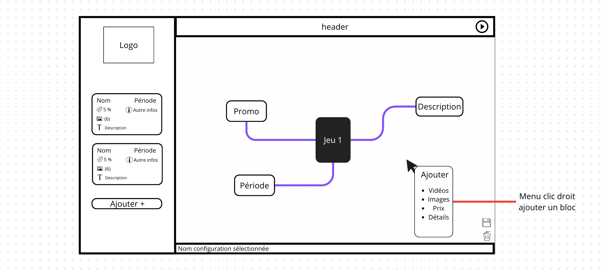

# Store Administration Interface Concept

J'ai pris le temps de réfléchir à la conception d'une interface d'administration pour le store. Très souvent, une interface d'administration affiche des champs (texte, nombre, date, etc.) pour pouvoir modifier les données d'un objet ou pour créer un nouvel objet.

La suppression d'un objet se fait souvent en cliquant sur un bouton, un icon sur l'objet cible. L'utilisateur doit donc utiliser sa souris pour interagir avec l'interface et je trouve que c'est un moyen d'intéraction qui est plus agréable à utiliser que d'utiliser un clavier pour remplir des champs. 

C'est pour cette raison que j'ai souhaité créer un wireframe qui permet de créer, éditer et supprimer des items depuis une interface plus interactive.

## Canva like

J'utilise souvent l'application Canva pour créer des images, des faire-parts, des couvertures de livres, etc... C'est un outil qui a concentré son travail sur l'UX et l'ergonomie. Pour ajouter un item, un cliqué-glisser suffit depuis le menu de gauche. Pour éditer un item, il suffit de le sélectionner et de le modifier. Pour supprimer un item, il suffit de le sélectionner et de cliquer sur le bouton de suppression.

## Wireframe

### Présentation du game config
C'est exactement ce que je souhaite faire pour l'édition du store. 

Sur la gauche on trouve la liste de tous les jeux disponibles. Sur la droite, on trouve ce que j'ai appelé le "game config". Il suffirait de glisser un des jeux pour voir appraitre toutes ses configurations

### Utilisation du game config

Lorsqu'un jeu est sélectionné, on peut voir toutes ses configurations apparaitrent autour du jeu avec des "_branches_". Chaque item serait déplaçable selon les envies de l'utilisateur et représenterait une configuration du jeu. Dans le wireframe, on voit qu'on a un case PROMO, Descriptions et Période. Ces cases permettront de configurer le jeu. 

### Ajoute d'une configuration

Pour ajouter une configuration, il suffit de faire une clique droit dans la zone "game config" et de sélectionner la configuration que l'on souhaite ajouter.

### Sauvegarde de configuration

Lorsqu'un jeu se trouve dans la zone "game config", il est possible de sauvegarder différentes configurations et de les voir dans le menu de gauche. Chaque bloc représente une configuration et est cliquable pour voir les détails de la configuration. 
Un mode preview devra être disponible pour voir les changements avant de les sauvegarder.

### Conclusion
Il faudra toujours remplir certains champs avec son clavier mais avec une interface plus interactive et plus agréable à utiliser. L'aide d'un web desginer expert en UX sera nécessaire pour créer une interface plus ergonomique et accompagner le développeur dans la création de l'interface. 
Étant donné la complexité de l'interface, des tests utilisateurs seront nécessaires à chaque étape de la création de l'interface.